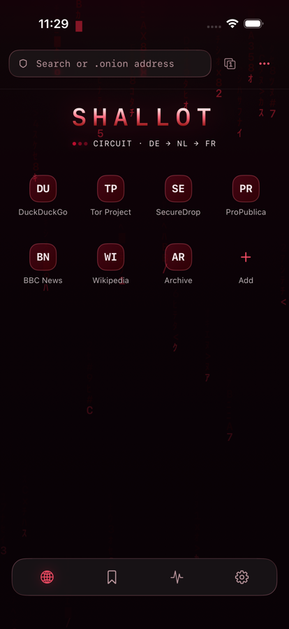
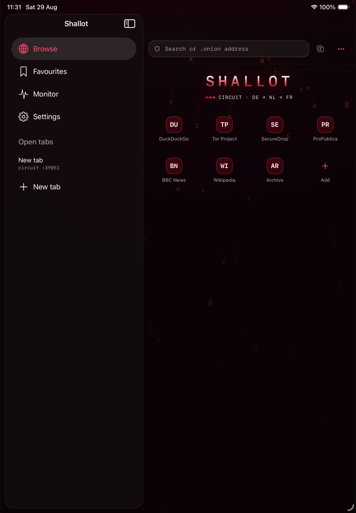

# Shallot

A Tor browser for iPhone and iPad. Universal SwiftUI app, embedded Tor, every
byte of web traffic routed over SOCKS5 through a local Tor client, `.onion`
reachable, nothing written to disk but favourites and settings.

<p align="center">
  
  &nbsp;&nbsp;
  
</p>

<p align="center"><em>Both shells bind to the same view models, so behaviour is identical and only the chrome differs. One row of chrome, which slides away while you scroll a page and comes back on the way up.</em></p>

---

## The constraint that shapes everything

iOS forbids third-party browser engines. Every browser on iPhone and iPad must
render with Apple's WebKit; the EU's DMA carved out a narrow alternative-engine
exception that does not apply in the UK or most of the world. Shallot is
therefore a **`WKWebView` routed through an embedded Tor**, not a hardened
Firefox fork like desktop Tor Browser.

Two consequences run through the whole codebase, and neither is negotiable:

**Network-layer anonymity is strong, and it is the core promise.** Tor hides the
real IP and location, makes destinations invisible to the local network and the
ISP, and reaches onion services. The routing is `WKWebsiteDataStore.proxyConfigurations`
with a SOCKS5 endpoint pointed at the in-process Tor — public API, no
entitlement required — and a kill switch that refuses to load anything at all
while Tor is not carrying traffic.

**Browser-fingerprint defence is weaker than desktop Tor Browser and cannot be
made equal.** We cannot patch the engine, so JavaScript fingerprinting surfaces
— canvas, WebGL, screen metrics, fonts — still largely reflect the device. What
we can do, we do: a three-step security level whose strongest setting turns
JavaScript off entirely, content rule lists below the JavaScript layer, and the
removal of the leaky APIs described below. What we cannot do, we say plainly in
Settings. Overstating this to a journalist or an activist is the one mistake
this app must never make.

There is a second hazard that is equally load-bearing. Independent research
published in August 2026 documented three WebKit features that reach the network
*outside* a configured proxy and leak the device's real IP and DNS regardless of
how carefully the proxy is set. They are not fixed at the OS level. Shallot
mitigates them itself; see [Security controls](#security-controls).

---

## Architecture

Layered and dependency-inverted. The UI depends on protocols; concrete services
are constructed once in a composition root and injected. Nothing above `Domain`
ever imports a concrete implementation of anything else, which is what makes
every screen drivable by a test double and the Tor library swappable.

```
App          Shallot/            ShallotApp · AppContainer · ShallotCommands
             (thin on purpose: entry point, composition root, ⌘-shortcuts)
             ─────────────────────────────────────────────────────────────
Features     Browser · Favourites · Monitor · Settings · Shell
             each screen = View + @Observable ViewModel, protocols only
             ─────────────────────────────────────────────────────────────
Domain       Models + protocols, no implementation, no UIKit
             TorServicing · BrowsingSessioning · FavouritesRepository
             SettingsStoring · MonitorFeeding · AppLocking
             ─────────────────────────────────────────────────────────────
Core         TorKit · BrowserEngine · Persistence · Monitoring · AppLock
             DesignSystem
             ─────────────────────────────────────────────────────────────
Platform     WebKit · Network.framework · LocalAuthentication · SwiftData
             swift-tor (→ swift-openssl, swift-event)
```

The core lives in one local Swift package, `Packages/ShallotCore`, whose
`Package.swift` records the dependency direction as a comment and enforces it
with target dependencies:

| Target | Depends on | What it owns |
|---|---|---|
| `Domain` | — | Models, protocols, pure logic (`URLNormalizer`, `OnionAddress`, `BridgeLineParser`, `AsyncBroadcast`), and the mock services used by tests and previews |
| `DesignSystem` | `Domain` | Palette, typography, glass chrome, the digital-rain canvas, the privacy shield |
| `TorKit` | `Domain`, `Tor` | `TorService` actor, `ControlChannel`, `SocksPortPool`, `CircuitStatusParser`, `PluggableTransport` |
| `BrowserEngine` | `Domain` | The proxied, hardened `WKWebView`: `ProxyConfigurator`, `NavigationPolicy`, `LeakMitigations`, `WebKitFeatureFlags`, `SecurityPolicy`, `ContentBlocker`, `TabSession`, `ErrorPage` |
| `Persistence` | `Domain` | SwiftData store for favourites and settings |
| `Monitoring` | `Domain` | Local-only aggregation of Tor and engine events |
| `AppLock` | `Domain` | LocalAuthentication gate |
| `Features` | `Domain`, `DesignSystem`, `BrowserEngine` | The four screens and the adaptive shell |

`Shallot/AppContainer.swift` is the composition root and the one place that
knows which Tor library, which storage engine and which authentication framework
are in use. It also decides whether the app is running as a test host — it
checks for `XCTestConfigurationFilePath` and the `--shallot-ui-testing` launch
argument — and if so substitutes `MockTorService` and an in-memory model
container. That is why the whole test suite is hermetic and needs no live Tor
network.

The one deliberate architectural compromise: `ShallotCore` has no test targets
of its own. Every suite lives in the app project's `ShallotTests`, because the
WebKit leak tests need a host application to run a real `WKWebView`, and one
command running every suite is worth more than two that can drift apart.

---

## Build and run

**Requirements:** Xcode 26 or later, Swift 6 with strict concurrency, an iOS 18
or later simulator or device.

```sh
open Shallot.xcodeproj      # packages resolve on first open
```

or from the command line:

```sh
xcodebuild -project Shallot.xcodeproj -scheme Shallot -resolvePackageDependencies
xcodebuild -project Shallot.xcodeproj -scheme Shallot \
  -destination 'generic/platform=iOS Simulator' build
```

The first resolve builds the embedded Tor C library and OpenSSL from source and
takes several minutes. Subsequent builds reuse it; CI caches it (see below).

**A note on the deployment target.** The build spec asks for iOS 17, because
that is the floor for `proxyConfigurations`, SwiftData and `@Observable`. The
shipping floor is **iOS 18**, forced by `swift-tor` declaring `.iOS(.v18)` in
its own manifest — and an embedded Tor is not something this app can do without.
`Packages/ShallotCore/Package.swift` records this in a named constant so the
reason travels with the decision, and `IPHONEOS_DEPLOYMENT_TARGET` on the app
target matches at 18.0.

Signing is standard automatic signing; the in-app proxy route needs **no special
entitlement**, because `proxyConfigurations` is public API. Only a system-wide
`NEPacketTunnelProvider` tunnel — explicitly out of scope — would need the
Network Extension entitlement.

Run on a **real device** for anything touching Tor or networking. The Simulator
uses the macOS networking stack and will mislead you about proxy and TLS
behaviour.

---

## Tests

Every suite that runs by default is hermetic: `AppContainer` detects a test
host and swaps in `MockTorService` and an in-memory store, so nothing below
needs the Tor network. The one exception is `LiveTorIntegrationTests`, which is
opt-in and covered further down.

```sh
# Unit, logic and security suites (Swift Testing)
xcodebuild test \
  -project Shallot.xcodeproj -scheme Shallot \
  -destination 'platform=iOS Simulator,name=iPhone 17 Pro' \
  -only-testing:ShallotTests

# UI suites (XCUITest)
xcodebuild test \
  -project Shallot.xcodeproj -scheme Shallot \
  -destination 'platform=iOS Simulator,name=iPhone 17 Pro' \
  -only-testing:ShallotUITests

# Everything
xcodebuild test \
  -project Shallot.xcodeproj -scheme Shallot \
  -destination 'platform=iOS Simulator,name=iPhone 17 Pro'
```

Any iOS 18-or-later simulator works, but **which model names exist depends on
the runtimes your Xcode ships** — `name=iPhone 16 Pro` fails on a machine whose
newest runtime has no iPhone 16 Pro, because xcodebuild resolves the name
against `OS:latest`. List what is actually there first:

```sh
xcodebuild -project Shallot.xcodeproj -scheme Shallot -showdestinations
xcrun simctl list devices available
```

CI does exactly that and picks the last iPhone `-showdestinations` reports,
which cannot be older than the deployment target. The adaptive shell has two
distinct layouts, so it is worth running the UI suite against both size classes:

```sh
-destination 'platform=iOS Simulator,name=iPhone 17 Pro'           # compact
-destination 'platform=iOS Simulator,name=iPad Pro 13-inch (M4)'   # regular
```

The security suites in `ShallotTests/Security/` — the leak probes and the
no-telemetry scan — are hermetic and run on every pull request: `WebKitLeakTests`
builds a real `WKWebView` exactly as the app does and loads its probe pages from
strings, so nothing leaves the machine, and `NoTelemetryTests` scans the shipping
source for outbound-request APIs outside `TorKit` and `BrowserEngine`.

The suites that would need a **live network** — real Tor bootstrap,
`check.torproject.org` routing verification, `.onion` reachability, two-tab
exit-IP isolation, and the published bypass proofs-of-concept — belong on a
device lane. The convention is that any test type whose name contains `Live` or
`Integration` is one of those: CI discovers them from the sources, skips them in
the pull-request job and runs them only from the manually-triggered
`live-integration` job. See [`.github/workflows/ci.yml`](.github/workflows/ci.yml).
No such suites exist in the tree yet, so that job currently reports that it has
nothing to run.

### Lint

```sh
swiftlint lint --strict                       # blocking gate; must be clean
xcrun swift-format lint --recursive Packages/ShallotCore/Sources Shallot ShallotTests ShallotUITests
```

`.swiftlint.yml` is tuned so `--strict` passes with zero violations on this
codebase; the rules that are off are off deliberately and each carries its
reason in the file. `.swift-format` matches the code that is already here — four
spaces, a 110-column target, multi-line string literals never reflowed, because
`LeakMitigations.source(for:)` *is* the script that runs on the page. swift-format
runs advisory rather than blocking: its pretty-printer disagrees with some
hand-wrapped call sites and with the full-sentence strings shown to users, and
reformatting security-critical files to satisfy a printer is not a trade worth
making.

---

## Security controls

Each control is a named type with a single home, so "what does this actually do"
has one answer a test can assert against.

### The kill switch and navigation rules

`BrowserEngine/NavigationPolicy.swift` — pure functions over a `Context` value,
deliberately free of WebKit types so the decisions can be tested directly rather
than through a live web view.

- Tor not carrying traffic → `.block(.torNotRunning)`, checked **before anything
  else and for every frame**, main and sub. Nothing leaves the device.
- `about:` is the sole exempt scheme: WebKit uses it to initialise a frame and it
  reaches no network, so refusing it would refuse the first frame of every tab.
- Anything outside `http`/`https` — `file:`, `data:`, `javascript:` — is blocked
  as a scheme that can reach outside the Tor connection.
- HTTPS-only upgrades `http` → `https` and blocks if the upgrade has already been
  tried and failed, so a site with no HTTPS listener produces a clear error
  rather than a redirect loop. Onion addresses are exempt: the address itself
  authenticates and encrypts the connection.
- Malformed v3 onion addresses are refused rather than handed to the resolver.

### Proxy routing

`BrowserEngine/ProxyConfigurator.swift` — three rules, each documented in place:
SOCKS5 rather than HTTP CONNECT (WebKit's HTTP-CONNECT path has known bugs, and
SOCKS5 hands the hostname to Tor for remote resolution, which is what keeps DNS
off the device); the data store is configured fully **before** the `WKWebView`
exists, because mutating `proxyConfigurations` on a live view interrupts
networking and has been reported to crash on iOS 18; and one non-persistent
store per tab, so nothing reaches disk and two tabs share no cookies, cache or
storage. `isProxied(_:)` is the assertion the engine and the leak tests both use
before anything is allowed to load.

### Per-tab circuit isolation

`TorKit/SocksPortPool.swift`. Desktop Tor Browser isolates per first-party domain
with SOCKS username/password and `IsolateSOCKSAuth`. **That does not work on
WKWebView** — credentials applied through `ProxyConfiguration.applyCredential`
are not reliably used. So `TorService` opens a bank of Tor `SOCKSPort` lines
(eight by default, `isolationPoolSize`) and points each tab's data store at a
different one; every port additionally carries `IsolateDestAddr IsolateDestPort`
so two sites visited in the same tab also get separate circuits. Assignment is
stable per tab, released on close, and past capacity keys share the least-loaded
port — degraded isolation beats refusing to open a tab. This is a correctness
decision, not an accident; do not simplify it back to SOCKS auth.

### WebKit proxy-bypass mitigations

`BrowserEngine/LeakMitigations.swift` and `BrowserEngine/WebKitFeatureFlags.swift`.
Three features reach the network outside the proxy, and WebRTC is a fourth of the
same kind:

| Bypass | What leaks | Mitigation |
|---|---|---|
| DNS prefetching (`<link rel="dns-prefetch">`, honoured since iOS 26) | Hostname resolved on the device's normal DNS path | `x-dns-prefetch-control: off` injected as a `<meta>`, plus a `MutationObserver` that strips `dns-prefetch`, `preconnect`, `prefetch` and `prerender` hints as they arrive |
| WebAuthn related-origin requests | Real IP, **with no user interaction at all** — the worst of the three | `navigator.credentials`, `PublicKeyCredential` and the authenticator response types removed |
| WebTransport | Real IP, direct connection | `WebTransport` and its stream types removed |
| WebRTC | Local and public addresses via ICE candidate gathering | `RTCPeerConnection` and the `getUserMedia` family removed |

There are **two layers, and only one of them is guaranteed.** The user script is
installed at `.atDocumentStart` for all frames, including sub-frames — a
third-party iframe is exactly where an unwanted prefetch or RTC probe turns up —
so it runs before any page script and a page can never capture a reference to an
API before it is removed. Where deletion is impossible because a property is
non-configurable, it is redefined as a getter returning `undefined` that reports
the attempt. Every blocked attempt is posted to a message handler and appears in
the Monitor's event log.

`WebKitFeatureFlags` is the second layer and is **best-effort by design**. It
turns the same features off inside the engine through `+[WKPreferences _features]`
and `-[WKPreferences _setEnabled:forFeature:]` — SPI, not public API. The key
strings move between releases, so it matches case-insensitive *fragments* rather
than exact names, guards every call with a runtime `responds(to:)` check, never
throws and never crashes, and returns an `Outcome` saying exactly what it managed
to disable and what this OS did not expose. If it disables nothing at all the app
is still protected; it simply protects at the JavaScript boundary rather than
inside the engine. Every SPI name lives in that one file, so when Apple ships the
OS-level fix there is one place to revisit.

Per-site opt-in re-enablement is available in Settings, off by default;
`LeakMitigations.Configuration(settings:host:)` is where a user's exception is
resolved for a given host.

### Security levels and content blocking

`BrowserEngine/SecurityPolicy.swift` maps `.standard | .safer | .safest` onto
WebKit configuration. Safest sets `allowsContentJavaScript = false`, which on an
engine we cannot patch is the strongest realistic anti-fingerprinting lever
there is. All levels get autoplay off, picture-in-picture off and
`upgradeKnownHostsToHTTPS`. `BrowserEngine/ContentBlocker.swift` compiles two
`WKContentRuleList`s — a base list of third-party trackers plus `make-https`, and
a strict list that additionally blocks remote fonts and third-party scripts —
enforced below the JavaScript layer, which catches sub-resources that never
reach the navigation delegate. The `make-https` rule deliberately excludes
onion domains and top-level documents: an onion address already authenticates
and encrypts the connection end to end and almost no onion service listens on
443, so upgrading one does not add security, it breaks the page. Top-level
navigation is `NavigationPolicy`'s job, because that is the only place that
knows about the exemption.

### Chrome

`Features/Browser/OmniBar.swift` is one row: back only when there is somewhere
to go back to, reload inside the pill, and everything that is not needed on
every page — new identity, saving a favourite, the security level — behind the
overflow menu. The leading glyph in the pill is the connection's security when
Tor is up and its bootstrap progress when it is not, because that is the state
worth the space.

`BrowserEngine/ChromeVisibilityPolicy.swift` decides when the chrome gets out of
the way. It is pure arithmetic over the scroll offset — hysteresis so an
inertial wobble cannot make it flicker, always visible near the top, and never
hideable on a page shorter than the viewport, because there would be no way to
scroll back up for it. The engine watches `contentOffset` through KVO rather
than taking the scroll view's delegate, which WebKit owns.

### Tor lifecycle

`TorKit/TorService.swift`, an `actor`, and the only type in the app that imports
the Tor library at all. The embedded Tor C library keeps process-global state and
**cannot be restarted inside the same process** once stopped, so: Tor starts
exactly once per launch; New Identity is `SIGNAL NEWNYM` over the control
channel, never a restart; and configuration Tor only reads at start-up — bridges,
the SOCKS port bank — is decided before `start()`, with a change surfacing a
relaunch-required flow in Settings. There is no `stop()`-then-`start()` path, and
adding one would appear to work in the Simulator and wedge on device.

The consensus cache is persistent on purpose (`AppContainer.torCacheDirectory()`):
it turns a ~40-second cold bootstrap into a 5–10 second warm one, and holds only
the public directory every Tor client downloads. GeoIP databases are bundled and
resolved on-device, so relay country labels in the Monitor cost no network call.

### Everything else

- **Persistence** — `Persistence/` stores favourites and settings only, via
  SwiftData, with `FileProtectionType.complete` applied to the store file and
  its sidecars (SwiftData has no API for this, so `ShallotModelContainer` sets
  the protection class directly). No browsing history is ever written; cookies,
  cache, page data, tabs and monitor logs are all in-memory. No cloud sync: sync
  is a deanonymisation surface.
- **App lock** — `AppLock/AppLockService.swift` gates entry with Face ID, Touch
  ID or the device passcode; `DesignSystem/PrivacyShield.swift` covers the app
  when the scene goes inactive so the app-switcher snapshot never shows a page.
  `NSFaceIDUsageDescription` is in `Info.plist`.
- **Monitoring** — `Monitoring/MonitorService.swift` aggregates circuit chain,
  bootstrap progress, bandwidth and the security-event log. All computed locally.
  No telemetry, no analytics, no crash reporting: there is no network egress
  except Tor's own and loopback.
- **Transport security** — ATS stays on for the app's own networking.
  `NSAllowsArbitraryLoadsInWebContent` is set because onion services almost never
  serve TLS and a browser that cannot load `http://` is not a browser; Shallot's
  own HTTPS-only mode, on by default and implemented in `NavigationPolicy`, is
  the control that actually governs insecure page loads.

### The live suite

`ShallotTests/Security/LiveTorIntegrationTests.swift` is the one suite that
talks to the real Tor network. It bootstraps a real Tor and asserts what the app
actually promises: that `check.torproject.org` reports `IsTor` true with an
address that is not this machine's — including through the app's own
`WKWebView`, not just a `URLSession` standing in for it — that two tabs leave by
two different exit relays, and that an onion service loads.

It is skipped unless switched on. `xcodebuild` does not forward its own
environment into a test host running in the simulator, so the switch is a marker
file on the shared filesystem:

```sh
touch /tmp/shallot-live-tests
xcodebuild test \
  -project Shallot.xcodeproj -scheme Shallot \
  -destination 'platform=iOS Simulator,name=iPhone 17 Pro' \
  -parallel-testing-enabled NO \
  -only-testing:ShallotTests/LiveTorIntegrationTests
```

`-parallel-testing-enabled NO` matters: parallel clones would each start their
own Tor and race for the same public endpoint. Setting `SHALLOT_LIVE_TESTS=1`
works too where the environment does reach the test host. CI runs this on a
manual job, never on a pull request — Tor exit traffic from shared runners is
frequently blocked or captcha'd, and a flaky gate is one people learn to ignore.

---

## Deliberate limitations

These are decisions, not bugs. Each one is recorded here so nobody has to
rediscover it from the source.

**obfs4 and Snowflake do not work in this build.** Both are Go programs that on
iOS are linked in as a framework (IPtProxy is the usual one) running in-process
on a loopback SOCKS port that Tor dials with `ClientTransportPlugin`. That binary
is roughly 140 MB and the decision to ship it belongs to whoever ships the app,
so it is not bundled. What exists instead is the seam:
`TorKit/PluggableTransport.swift` defines `PluggableTransportProviding`, and
`AppContainer.liveTorConfiguration(bridges:)` passes `transportProvider: nil`
with a comment marking the spot. Registering a provider there is the whole
change. Until one is registered, **plain bridges work in full**, and the
obfuscating transports are shown in Settings as unavailable with the reason —
via `TransportAvailability` — rather than offered and then quietly failing to
connect on exactly the censored network where a user most needs them to work.

**`WebKitFeatureFlags` is best-effort, and is not the layer you rely on.** It
uses guarded WebKit SPI whose keys move between releases and may simply not be
listed on a given OS. It is a genuine second line of defence when it works, and
it reports honestly when it does not. The **guaranteed** layer is the
`.atDocumentStart` user script in `LeakMitigations`, which runs in every frame
before any page script. If you are reasoning about whether a leak is closed,
reason about the user script.

**`ITSAppUsesNonExemptEncryption` is declared `true`.** Tor is encryption, and an
anonymity proxy is not one of the exempt categories. This means **export-compliance
paperwork is required in App Store Connect at every submission**. Declaring
`false` to avoid it would be a false declaration. Tor apps are permitted on the
App Store — Onion Browser and Orbot both ship — so this is routine, but it is not
optional and it is not automatic.

**Fingerprint parity with desktop Tor Browser is impossible**, for the reason at
the top of this file. The in-app honesty statement in Settings exists because of
it and must not be softened.

**There are no snapshot tests.** The build spec asks for
`swift-snapshot-testing` across device sizes, Dynamic Type sizes and
Reduce Motion. Adding it means giving `ShallotTests` a Swift package
dependency, and doing that forces Xcode to build the whole package graph as
dynamic frameworks so the app and the test bundle can share it — at which point
`libcrypto` fails to link, because it resolves two symbols out of `libssl` that
only exist once everything is statically linked into one binary. The suites are
in one target for exactly that reason (see the note at the top of
`Packages/ShallotCore/Package.swift`). Layout regressions are covered instead by
the XCUITest accessibility audits and the UI suites, which run against both size
classes. Restoring snapshot testing means either vendoring the library's source
into the test target or fixing the upstream `libcrypto`/`libssl` split — neither
is a five-minute job, and pretending otherwise in a comment would be worse than
saying so here.

**Out of scope, deliberately:** system-wide tunnelling of other apps via
`NEPacketTunnelProvider` (would need the Network Extension entitlement), cloud
sync of anything, and any platform other than iOS and iPadOS.

---

## Repository layout

```
Shallot/                 app target — entry point, composition root, ⌘-shortcuts,
                         Assets.xcassets, bundled geoip/geoip6
Packages/ShallotCore/    the eight core modules
ShallotTests/            Swift Testing suites (Unit/; Security/ is where the
                         live leak suites land — empty in this build)
ShallotUITests/          XCUITest suites
Tools/make-app-icon.py   regenerates Assets.xcassets/AppIcon.appiconset/icon-1024.png
Tools/make-banner.py     regenerates docs/banner.gif — the README banner, a port
                         of DesignSystem/RainView.swift to Pillow
docs/banner.gif          the animated banner at the top of this file
.github/workflows/ci.yml build, test and lint on every PR; live suites on demand
desing files/            the build spec this was implemented against
```
