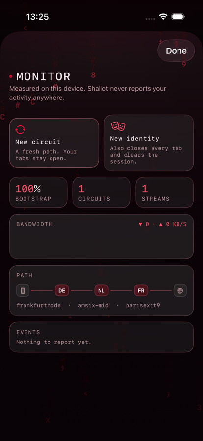

<p align="center">
  
</p>

<h1 align="center">Shallot</h1>

<p align="center">A Tor browser for iPhone and iPad. Every byte of web traffic routed over SOCKS5 through an embedded Tor client, <code>.onion</code> reachable, nothing written to disk but favourites and settings.</p>

<p align="center">
  <a href="https://github.com/cristianexer/Shallot/actions/workflows/ci.yml"></a>
  <a href="LICENSE"></a>
  
  
</p>

<p align="center">
  &nbsp;
</p>

<p align="center">
  
</p>

<p align="center"><em>One row of chrome, which slides away while you scroll a page and comes back on the way up. Both shells bind to the same view models, so behaviour is identical and only the chrome differs.</em></p>

## What it is

iOS forbids third-party browser engines. Every browser on iPhone and iPad must render with Apple's
WebKit, and the EU's DMA alternative-engine exception does not apply in the UK or most of the world.
Shallot is therefore a **`WKWebView` routed through an embedded Tor**, not a hardened Firefox fork
like desktop Tor Browser. Two consequences run through the whole codebase, and neither is negotiable.

**Network-layer anonymity is strong, and it is the core promise.** Tor hides the real IP and
location, makes destinations invisible to the local network and the ISP, and reaches onion services.
The routing is `WKWebsiteDataStore.proxyConfigurations` with a SOCKS5 endpoint pointed at the
in-process Tor — public API, no entitlement required — behind a kill switch that refuses to load
anything at all while Tor is not carrying traffic.

**Browser-fingerprint defence is weaker than desktop Tor Browser and cannot be made equal.** We
cannot patch the engine, so JavaScript fingerprinting surfaces — canvas, WebGL, screen metrics,
fonts — still largely reflect the device. What we can do, we do: a three-step security level whose
strongest setting turns JavaScript off entirely, content rule lists below the JavaScript layer, and
the removal of the leaky APIs listed below. What we cannot do, the app says plainly in Settings:

> Shallot hides your IP address and location and reaches .onion sites. Because iOS requires every
> browser to use Apple's web engine, it cannot fully match desktop Tor Browser's anti-fingerprinting
> — raise the security level for more protection.

**Overstating this to a journalist or an activist is the one mistake this project must never make.**
If you contribute here, that statement is not marketing copy to be tightened; it is a promise about
what the software will and will not claim.

## What it does

- **Kill switch** — with Tor not carrying traffic, every frame is blocked, main and sub.
- **Per-tab circuit isolation** — a bank of Tor `SOCKSPort` lines, one per tab, each carrying `IsolateDestAddr IsolateDestPort`.
- **Four leak mitigations** — DNS prefetching, WebAuthn related-origin requests, WebTransport and WebRTC all reach the network outside a configured proxy; all four are removed at document start, in every frame.
- **HTTPS-only, onion exempt** — `http` is upgraded or blocked; an onion address already authenticates and encrypts the connection.
- **Ephemeral by default** — one non-persistent data store per tab. No history, no shared cookies, no cache on disk.
- **Encrypted favourites** — favourites and settings only, under `FileProtectionType.complete`. No cloud sync.
- **App lock** — Face ID, Touch ID or passcode, plus a privacy shield over the app-switcher snapshot.
- **No telemetry** — no analytics, no crash reporting, no server of any kind.

How each is implemented, and why, is in [docs/ARCHITECTURE.md](docs/ARCHITECTURE.md).

## Verified, not asserted

Anonymity claims are cheap. `ShallotTests/Security/LiveTorIntegrationTests.swift` bootstraps a real
Tor against the real network and checks the promises this app makes, one test per claim: that Tor
bootstraps and builds a three-hop circuit labelled from the *bundled* GeoIP databases; that
`check.torproject.org/api/ip` returns `IsTor: true` proxied and `false` direct, from a different
address; that the exact `WKWebView` the app builds — not a stand-in `URLSession` — gets the same
answer; that two tabs leave by two different exit relays; that two independent onion services load in
that web view, which is the observable form of "DNS never happens on this device"; that the Monitor's
numbers are real; and that New Identity works and traffic still flows afterwards.

Two further suites are hermetic and run on **every pull request**. `WebKitLeakTests` builds a real
`WKWebView` as the app does and asserts that prefetch hints are stripped, that the leaky APIs are
unreachable from a page, that a per-site opt-in restores a feature *and only for that site*, and that
with Tor down nothing loads. `NoTelemetryTests` scans the shipping sources and fails the build if any
module other than `TorKit` and `BrowserEngine` so much as mentions a networking API, if an analytics
SDK is imported anywhere, or if anything touches `UserDefaults`.

## Build and run

Xcode 26 or later, Swift 6 with strict concurrency, and an iOS 18 or later simulator or device. The
floor is iOS 18 because `swift-tor` declares `.iOS(.v18)` in its own manifest, and an embedded Tor is
not something this app can do without.

```sh
git clone https://github.com/cristianexer/Shallot.git && cd Shallot
xcodebuild -project Shallot.xcodeproj -scheme Shallot -destination 'generic/platform=iOS Simulator' build
xcodebuild test -project Shallot.xcodeproj -scheme Shallot -destination 'platform=iOS Simulator,name=iPhone 17 Pro'
```

The first resolve builds the embedded Tor C library and OpenSSL from source and takes several
minutes; subsequent builds reuse it. Run on a **real device** for anything touching Tor or
networking — the Simulator uses the macOS networking stack and will mislead you. The full test
matrix, the lint gates and how to enable the live Tor suite are in
[docs/ARCHITECTURE.md](docs/ARCHITECTURE.md#tests).

## Limitations

These are decisions, not bugs, and several are good places to start contributing.

- **No obfs4 or Snowflake.** The Go transport framework is roughly 140 MB and shipping it is the decision of whoever ships the app. The seam exists: `TorKit/PluggableTransport.swift` defines `PluggableTransportProviding` and `AppContainer.liveTorConfiguration(bridges:)` passes `transportProvider: nil`. Plain bridges work in full, and the obfuscating transports are shown as unavailable with the reason rather than failing quietly on a censored network.
- **`WebKitFeatureFlags` is best-effort.** It uses guarded WebKit SPI whose keys move between releases. The guaranteed layer is the `.atDocumentStart` user script in `LeakMitigations`; that is the one to reason about.
- **`ITSAppUsesNonExemptEncryption` is `true`.** Tor is encryption and an anonymity proxy is not exempt, so export-compliance paperwork is required at every App Store submission. Declaring `false` would be a false declaration.
- **No snapshot tests.** Giving `ShallotTests` a package dependency forces the graph into dynamic frameworks, and `libcrypto` then fails to link against `libssl`. Layout is covered by the XCUITest accessibility audits and the UI suites instead.
- **English only.** Every user-facing string is a literal in the source — a real gap for an app whose users are disproportionately outside the anglophone world.
- **Fingerprint parity with desktop Tor Browser is impossible**, for the reason at the top of this file. The honesty statement in Settings exists because of it and must not be softened.
- **Out of scope, deliberately:** system-wide tunnelling via `NEPacketTunnelProvider`, cloud sync of anything, and any platform other than iOS and iPadOS.

## Threat model

**Shallot is designed to stop** your ISP, carrier, employer or a café's Wi-Fi learning which sites
you visit; sites learning your real IP or approximate location; two tabs being trivially linked,
since each has its own circuit, exit relay and cookie jar; cross-site trackers; the leaky WebKit
features resolving DNS or opening a connection outside Tor; anything reaching the network while Tor
is down; someone who seizes your locked device recovering your browsing; and Shallot itself learning
anything about you.

**Shallot cannot protect you from** a compromised device — malware, a jailbreak or a coerced unlock
defeats everything here; logging in, because Tor cannot unsay what you have typed; a global adversary
who can correlate timing and volume at both ends, which is a limit of Tor's design and of desktop Tor
Browser too; browser fingerprinting, the honest weak point, though Safest turns JavaScript off and
removes most of that surface; or someone reading over your shoulder. If your safety depends on not
being fingerprinted, use desktop Tor Browser on a computer you control. If it depends on your network
and the sites you visit not knowing who or where you are, that is what this app is for.

## Contributing

Contributions are welcome. Read [CONTRIBUTING.md](CONTRIBUTING.md) first — it covers the module
graph and the rule that dependencies point downward, the commenting and British-English conventions,
Swift 6 strict concurrency, and the constraints that must not be broken. Everyone taking part is
expected to follow the [Code of Conduct](CODE_OF_CONDUCT.md). If you have found something that can
leak a real IP address or DNS query, **do not open a public issue** — see [SECURITY.md](SECURITY.md).

Good first issues, each a limitation above with a seam already cut for it:

- Wire `PluggableTransportProviding` to IPtProxy — the highest-value change here, because it is what makes Shallot usable from a censored network.
- Restore snapshot testing, by vendoring the library's source or fixing the `libcrypto`/`libssl` link failure.
- More leak-test coverage: service workers, `<link rel="preload">`, WebSockets, beacon, `EventSource`, and adversarial pages that try to capture a removed API first.
- Localisation — string catalogues and translations, with the honesty statement and the error copy staying exactly as truthful in every language.
- Accessibility — VoiceOver ergonomics on the Monitor's circuit view and the tab overview.

Smaller and just as welcome: additions to `ContentBlocker.trackerHosts`, better error copy, and any
test that turns an assumption in the code into something the suite checks.

## Credits and licence

**[The Tor Project](https://www.torproject.org)**, for the network, the client and the research that
makes any of this possible — Shallot is independent and is not affiliated with or endorsed by them,
so if it is useful to you, [donate to them](https://donate.torproject.org) rather than to me.
**[`swift-tor`](https://github.com/21-DOT-DEV/swift-tor) by 21-DOT-DEV**, the concurrency-first Swift
wrapper the whole of `TorKit` is built on. **[Mysk](https://mysk.blog)** — Talal Haj Bakry and Tommy
Mysk — whose [research into WebKit's proxy bypasses](https://mysk.blog/2026/08/04/webkit-proxy-icloud-private-relay-ip-leak/)
is the reason `LeakMitigations` exists.

Licensed [MIT](LICENSE). Copyright (c) 2026 Daniel Fat.
